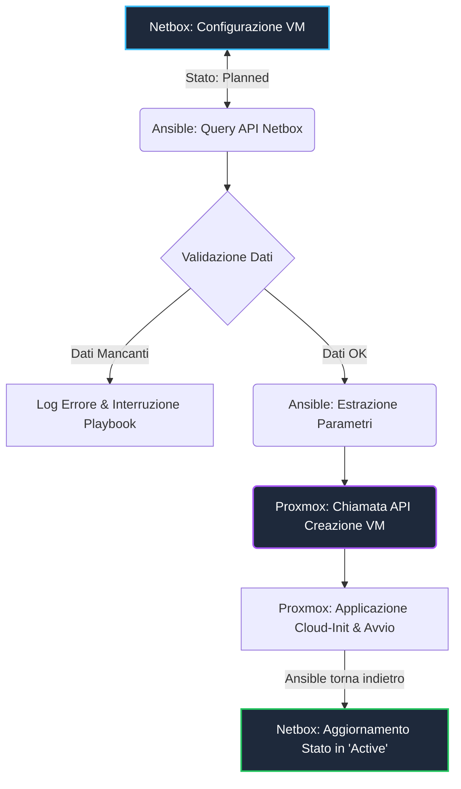

#Linux 

# **Obiettivo dell'automazione**

>**1. Pianificare la VM/Container su Netbox**
>Vogliamo poter stabilire su Netbox una macchina virtuale / Container (assieme alle sue risorse e configurazioni di rete) su Planned.
>
>**2. Ansible recupera Info**
>La configurazione della macchina da Netbox  viene recuperata da Ansible tramite API. Ansible ne controlla la configurazione per evitare di creare VM/Container con una configurazione errata
>Con un playbook.
>
>**3. Proxmox hypervisor**
>Riceve le informazioni dal playbook di Ansible, clona il template e configura l'hardware e la rete.
>
>**4. Chiusura del Ciclo**
>Ansible controlla la VM se è stata avviata con successo e solo in questo caso aggiorna lo stato della macchina su Netbox in Attivo.





---
# **Installazione delle dipendenze**

>Per far funzionare il tutto avremo bisogno di moduli creati e mantenuti dalla community di Ansible.

>Inizializzazione di un venv e relativa attivazione:
```shell
python -m venv .env

source .env/bin/activate
```

>Installazione di Ansible e la libreria pynetbox e proxmoxer:
```shell
pip install ansible pynetbox proxmoxer
```

>Installazione del modulo Ansible per netbox e per proxmox:
```shell
ansible-galaxy collection install netbox.netbox
ansible-galaxy collection install community.proxmox
```

---
# **Struttura delle cartelle ed inizializzazione**

>Abbiamo ordinato la directory del progetto in questo modo:
```txt
ansible-proxmox-netbox-automatation/
├── group_vars/
│   └── all/
│       ├── vars.yml
│       └── vault.yml
├── roles/                     # 📁 Contenitore di tutti i ruoli del progetto
│   └── netbox_manage_vm/      # 🏷️ Ruolo specifico per la gestione delle VM
│       ├── tasks/
│       │   └── main.yml       # ⚙️ Qui sposteremo i nostri task di creazione
│       └── defaults/
│           └── main.yml       # 📊 Valori di default specifici per questo ruolo
├── ansible.cfg
├── site.yml                   # 🗺️ Il nuovo playbook principale che richiama i ruoli
└── test.yml                   # 🧪 Il file di test che abbiamo usato finora

```

## **group_vars/all**
>Al suo interno teniamo le variabili che servono ad ogni ruolo.

>Dentro **vars.yml** teniamo quelle che non sono private e sensibili:
```yml
# Variabili per Proxmox

netbox_api_url: "https://aghv4513.cloud.netboxapp.com/"

netbox_token: "{{ vault_netbox_token }}"

#########################################################

#Variabili clietn Mail

smtp_server: "smtp.azienda.it"

smtp_user: "ansible-alerts@azienda.it"

##########################################################  

# Variabili per Proxmox

proxmox_api_host: "192.168.1.200"

proxmox_api_user: "root@pam"

proxmox_api_token_id: "ansible-auto"

proxmox_node: "pve"

proxmox_api_token_val: "{{ vault_proxmox_api_password }}" # Richiama il valore cifrato nel vault

##########################################################

#Vm

target_vm_name: "automazione-netbox"
```

>Dentro  **vault.yml** teniamo i dati sensibili che devono essere accessibili solo a noi.
>Questi dati sono protetti da un vault di Ansible che cripta ed offusca i dati richiedendo una password per decriptare.

>Questo file conterrà le chiavi API del nostro playbook, in questo caso quelle di Netbox e di Proxmox e la password del client mail.
>**==devono avere gli stessi nomi che vengono ripresi in vars.yml==**

## **roles**
>Abbiamo creato 3 ruoli:
>- mail_sender:
>  contiene tutto quello che riguarda la parte di notifica al sysadmin con il relativo client SMTP
>- netbox_retrieveconf:
>  contiene tutto quello che riguarda il pescaggio delle info da Netbox
>- proxmox_ops:
>  contiene tutto quello che riguarda la creazione e la configurazione delle macchina proxmox

## **ansible.cfg**
>Al suo interno abbiamo inserito il path del file che contiene la password del vault.
>Questo file si trova all'esterno della repo in modo che quando si pusha un cambiamento non c'è alcun modo in cui esso possa essere coinvolto.

```yml
[defaults]
vault_password_file = path/segreto/al/file/
```
>La sua funzione principale è quella di permettere ad Ansible di eseguire il playbook senza dover richiedere la password del vault.

---

# **Direzione del playbook con i ruoli**
>Visto che abbiamo creato un organizzazione basata sui ruoli ci servirà un file di orchestrazione dei vari ruoli.

>site.yml
```yml
- name: Orchestratore dei ruoli
  hosts: localhost      #Macchina su cui eseguire il codice
  
  roles:
	- role: netbox_retrieve_conf
	- role: proxmox_ops
	- role: mail_sender
```

---

# **netbox_retrieve_conf**
>Questo ruolo si occuperà di salvare le informazioni che abbiamo inserito su Netbox per poterle passare successivamente a Proxmox per la creazione vera e propria sul nodo.

## **Autenticazione**
>Per autenticarci useremo le API di netbox

>**Procedure per creare il proprio token API:
>1. Visitare la propria pagina di Netbox
>2. Cliccare sulla sezione col proprio username e andare sulla sezione API Tokens
>3. Cliccare su Add tokens e configurarlo come si voglia (descrizione e IP ammessi)

>[!ATTENTION] Salvare il token API in un vault Ansible

>Non ci sono moduli della collezione netbox.netbox che permettono di ottenere direttamente le specifiche di una macchina .
>Quindi abbiamo proceduto con una richiesta GET HTTP che va a prendere la configurazione in base al nome della macchina (in questo caso una VM) e ci riporta le informazioni in formato JSON.

>Risposta JSON dall' URL:
```json
{
  "count": 1,
  "next": null,
  "previous": null,
  "results": [                       //Prendiamo solo i valori all'interno della                                       lista results, perchè sono qua dentro i                                          dati di interesse
    {
      "id": 2,
      "name": "vm-test-stagista",
      "status": { "value": "planned" },
      ...
    }
  ]
}
```

>main.yml
```yml
---
- name: Recupera i dettagli della VM da NetBox tramite API REST
	ansible.builtin.uri: #Con questo modulo possiamo fare delle chiamate API alla nostra dashboard di Netbox
		url: "{{ netbox_api_url }}/api/virtualization/virtual-machines/?name={{ target_vm_name }}" #specifichiamo l'url del nostro menù con la nostra variabile, e poi passiamo anche il PATH
#in cui va a cercare la nostra vm con ?name={{ target_vm_name }}
		method: GET
		headers:
			Authorization: "Token {{ netbox_token }}" #Qui diamo i parametri per poter accedere a questo PATH
			Accept: "application/json" #Specifichiamo il tipo di formato che richiediamo
		status_code: 200
	register: netbox_api_response #Salva TUTTA la risposta JSON in questa variabile

- name: Verifica se la VM esiste su NetBox
	ansible.builtin.assert: #ansible.builtin.assert funziona come un if nella programmazione
		that:
			- netbox_api_response.json.results | length > 0 #condizione da controllare
		fail_msg: "ERRORE: La VM '{{ target_vm_name }}' non è stata trovata su NetBox!" #Risposta di errore
	success_msg: "Sincronizzazione completata: VM trovata con successo su NetBox." #Risposta di successo

- name: Estrai e salva i dati utili della VM
	ansible.builtin.set_fact: #Crea o aggiorna una variabile (in questo caso crea)
		vm_details: "{{ netbox_api_response.json.results[0] }}" #Salva SOLO la sezione dei risultati in questa variabile
- name: Mostra un riepilogo dei dati principali estratti
	ansible.builtin.debug:
		msg:
		- "Nome VM: {{ vm_details.name }}" #Visto che abbiamo salvato SOLO la sezione .results possiamo accedere ai valori che necessitiamo senza problemi
		- "Stato: {{ vm_details.status.value }}"
		- "vCPU: {{ vm_details.vcpus | default('Non definite') }}"
		- "RAM (MB): {{ vm_details.memory | default('Non definita') }}"
```


---

# **proxmox_ops**
>Questo ruolo si occupa di interagire con Proxmox e creare e configurare le macchine.

## **Autenticazione**
>Per autenticarsi usermo le API di Proxmox

### Come creare il token API per Proxmox e dare l'accesso
>**1. Andare sulla pagina del proprio datacenter**
>**2. Navigare nel menù del datacenter fino alla voce Permissions**
>**3. Aprirla e selezionare API Tokens**
>**4. Fare Add e dire**
>   **- user: lo user con cui Ansible entrerà (root oppure per sicurezza utente dedicato)**
>   **- token ID: dare un nome a questo token**
>   **- privilege separation: togliere la spunta**
>   **- commento per definirne l'uso**

>[!ATTENTION] Una volta creata uscirà solo per quella volta il token, una volta usciti non sarà più visibile

>- **Andare sulla sezione Permissions cliccare su Add --> API Token Permissions**
>    - **Path = /** 
>    - **API Token = token ID**
>    - **Role = Administrator**

>[!IMPORTANT] Salvare l'API (volendo anche il token ID) in un vault Ansible

>main.yml
```yml
---
- name: Verifica la connessione a Proxmox e recupera le VM esistenti
	community.proxmox.proxmox_vm_info:
		api_host: "{{ proxmox_api_host }}"
		api_user: "{{ proxmox_api_user }}"
		api_token_id: "{{ proxmox_api_token_id }}"
		api_token_secret: "{{ proxmox_api_token_val }}"
		validate_certs: false
```

