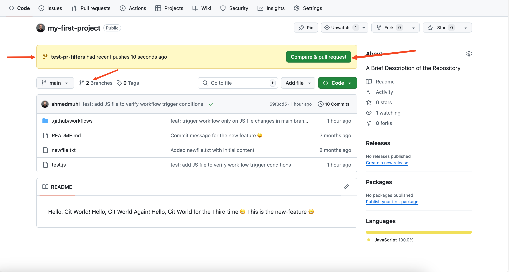
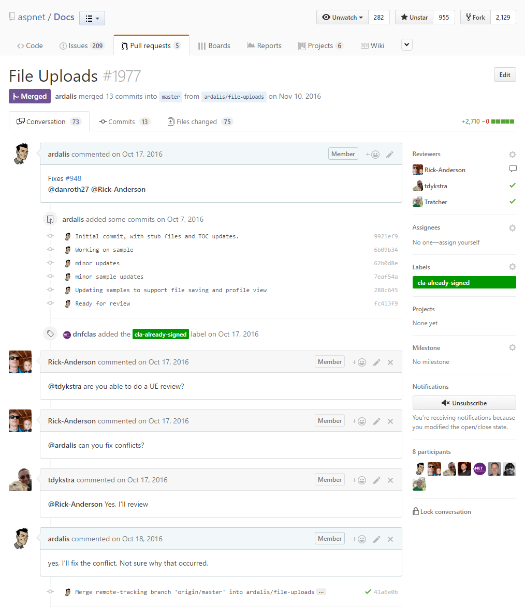

#GitHub 

# **Issues**
>E' una taskbar di Github che permette di aprire dei problemi riguardanti il codice dell'applicazione/immagini/bug ecc...

>In questa parte descriviamo quale sia il problema in modo descrittivo. 
>Una buona forma per scrivere ISSUE è:
```Markdown
### Description  
(Provide a clear and concise description of the problem.)  

### Steps to Reproduce  
1. [Step 1]  
2. [Step 2]  

### Expected Behavior  
(Explain what you expected to happen.)  

### Actual Behavior  
(Explain what actually happened.)  

### Environment  
- OS:  
- Browser/Version:  

### Additional Information  
(Add screenshots, logs, or other helpful details.)  
```

>[!IMPORTANT] Inoltre risulta organizzato e utile dire anche:
>- Assegnatario (Chi si occuperà di risolvere l'issue)
>- Etichetta (Bug, enhancement, documentation, ecc...)

> [!NOTE] **Si può creare e configurare il template degli Issues nella cartella .github/ISSUE_TEMPLATE**

---
# **Procedimento di risoluzione degli ISSUE**

1. Clonare la repository 
   >**OPPURE ENTRARE NELLA REPOSITORY CHE SI HA GIA'**
```Bash
git clone URL_REPOSITORY    
```
2. Creare un nuovo branch con:
```Bash
git checkout -b nome_branch   
```
3. Modificare il file che ha bisogno di essere modificato
4. Pushare su Github le modifiche con dei messaggi chiari come:
```Bash
git status
git add .
git commit -m "fix/doc: Descrizione Problema"
git push origin nome_branch
```
5. Una volta pushati su GitHub apparirà una notifica come questa: 


---

# **Pull Requests**
>Aprendo questa notifica si potranno aprire delle pull requests che vanno a chiudere (close) degli issue insieme al tag.
>Permettono di mettere a fine le modifiche e pusharle sul main (o il branch specificato) in modo semplice e intuitivo. Evitando Merge o cicli lunghi di passaggio di info sul lavoro svolto.

>Esempio:


>[!ATTENTION] Cosa deve essere all'interno della pull request?
>- Titolo dell'Issue risolto + ID
>- Assegnare Code Reviewer (chi si occupa di controllare e validare le modifiche apportate)
>- Assegnare assegnatario (chi si è occupato di risolvere l'issue)
>- Assegnare il TAG (bug, enhancement, documentation, ecc...)
>- Descrizione del problema precedente in breve
>- **Descrizione di cosa si ha messo a posto e come**
>- **MOLTO IMPORTANTE:**
>- **closes # id_del_issue** (dovrebbe comparire da solo dopo il #)

# **Cosa fa il Code-Reviewer?**

>Il Code-Reviewer controllerà il lavoro svolto dall'assegnatario e può:
>- lasciare una review sul codice
>  può lasciare aperta la pull request se necessita di altre modifiche
>  chiuderla con una review positiva 
>- dare il messaggio di approve
>- fare il merge sul branch main