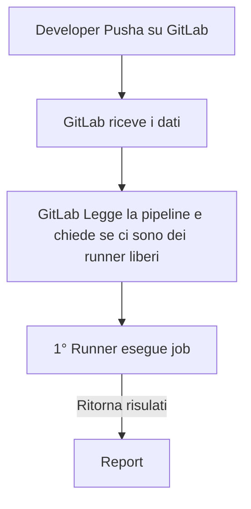

#GitLab

# **Cos' è?**
>GitLab è una piattaforma OpenSource pensata per gestire l'intero ciclo di vita sia del software che dell'infrastruttura (DevOps) sotto un unica cosa che mantiene il versionamento con il suo motore git. 
>Pensata per il CI/CD

>Le principali differenze con GitHub sono:
>- self-hosted, nativamente GitLab può essere installato sui propri server Linux con totale sovranità sui dati
>- **runner**, sono agenti leggeri da installare direttamente sul nodo/VM/container
>- registro pacchetti, registro integrato per immagini docker, pacchetti .deb, PyPI e npm.

>Per l'automazione DevOps vi sono due principali ambiti da comprendere:
>- **PipeLine** [[#**Pipeline**]]
>- **Runner** [[#**Runner**]]



---
# **Pipeline**
>La Pipeline è il file di configurazione che salviamo nel repository.
>Descrive la sequenza cronologica delle operazioni in Stages (es. build, publish, ecc...) e Job (i compiti da eseguire).

>La pipeline consiste in un file YAML.
>Questo file ha 4 blocchi principali:

>1. **stages:** definisce l'elenco e l'ordine temporale delle fasi della pipeline (es. compilazione, test, pubblicazione). Se uno stage fallisce quelli successivi non verranno eseguiti.
>   ***Jobs dello stesso stage vengono eseguiti in contemporanea***
>   
>2. **jobs:** sono i contenitori delle azioni da eseguire. Ogni job ha il suo nome personale
>   
>3. **image:** specifica l'ambiente isolato (container Docker) in cui il Runner farà girare quel job.
>   ***Una volta finito il Job quel container viene eliminato assieme ai file al suo interno***
>  
>4. **script e before_script:** 
>   before_script: indica i comandi bash di preparazione (es. installazione di tool di sistema, chiavi ssh, ecc...)
>   script: l'elenco dei comandi Bash eseguiti in sequenza per portare a termine il job
>   
>5. **artifacts:** visto che una volta che i job sono stati completati i container dentro cui si sono svolti vengono distrutti assieme a tutti i suoi file serviva qualcosa per conservare i dati che ci interessano.
>   Gli artifacts ci permettono di salvare questi dati prima che vengano distrutti.


>Esempio di una pipeline:
>esempio.gitlab-ci.yml
```yml
stages:
  - build
  - test
  - deploy

job-compilazione:
  stage: build
  image: ubuntu:noble
  script:
    - echo "=== Avvio compilazione"
    - gcc main.c -o mio_programma
    - dpkg-buildpackage -b -uc -us   #Compila il pacchetto e non chiede alcuna firma digitale
    - mkdir -p build_output/
    - mv ../*.deb build_output/
  artifacts:
    paths:
      - build_output/*.deb
    expire_in: 1 week  #Tempo di conservazione su GitLab

test-pacchetto:
  stage: test
  script:
    - dpkg -i build_output/*.deb
  dependencies:
    - job-compilazione      #nome esatto del job da cui prendere gli artifacts

job-pubblicazione:
  stage: deploy
  script:
    - echo "=== Invio al server ==="
```

---
# **Runner**
>I Runner sono programmi installati sul nodo/VM/container che eseguono le istruzioni all'interno dei job della Pipeline.

>Continua a chiedere al server GitLab se ci sono job da eseguire, quindi è già integrato nella rete.

>Ogni runner ha la sua configurazione in un unico file sul server:
>/etc/gitlab-runner/config.toml

```TOML
concurrent = 4 # ⚡ Numero massimo di job eseguibili in parallelo

[[runners]]
  name = "runner-aziendale-01"
  url = "https://gitlab.azienda.local/" # 🌐 URL del server GitLab
  token = "glrt-xxxxxxxxxxxx"            # 🔑 Token di autenticazione
  executor = "docker"                    # 🐳 Modalità di esecuzione

  [runners.docker]
    image = "ubuntu:22.04"               # 🖼️ Immagine predefinita
    privileged = false

  # 🌐 Iniezione delle variabili di rete/proxy nei container
  environment = [
    "http_proxy=http://proxy.azienda.local:8080",
    "https_proxy=http://proxy.azienda.local:8080"
  ]
```