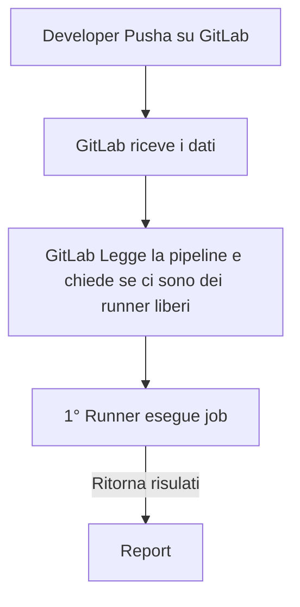
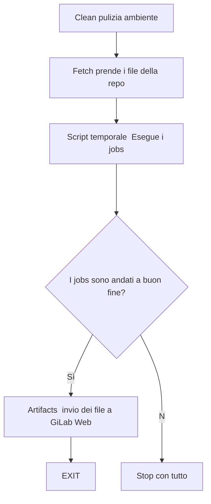

#GitLab

# **Cos' è?**
>GitLab è una piattaforma OpenSource pensata per gestire l'intero ciclo di vita sia del software che dell'infrastruttura (DevOps) sotto un unica cosa che mantiene il versionamento con il suo motore git. 
>Pensata per il CI/CD

>Le principali differenze con GitHub sono:
>- self-hosted, nativamente GitLab può essere installato sui propri server Linux con totale sovranità sui dati
>- **runner**, sono agenti leggeri da installare direttamente sul nodo/VM/container
>- registro pacchetti, registro integrato per immagini docker, pacchetti .deb, PyPI e npm.

>Per l'automazione DevOps vi sono due principali ambiti da comprendere:
>- **PipeLine** [[#**Pipeline**]]
>- **Runner** [[#**Runner**]]



---
# **Pipeline**
>La Pipeline è il file di configurazione che salviamo nel repository.
>Descrive la sequenza cronologica delle operazioni in Stages (es. build, publish, ecc...) e Job (i compiti da eseguire).

>La pipeline consiste in un file YAML.
>Questo file ha 4 blocchi principali:

>1. **stages:** definisce l'elenco e l'ordine temporale delle fasi della pipeline (es. compilazione, test, pubblicazione). Se uno stage fallisce quelli successivi non verranno eseguiti.
>   ***Jobs dello stesso stage vengono eseguiti in contemporanea***
>   
>2. **jobs:** sono i contenitori delle azioni da eseguire. Ogni job ha il suo nome personale
>   
>3. **image:** specifica l'ambiente isolato (container Docker) in cui il Runner farà girare quel job.
>   ***Una volta finito il Job quel container viene eliminato assieme ai file al suo interno***
>  
>4. **script e before_script:** 
>   before_script: indica i comandi bash di preparazione (es. installazione di tool di sistema, chiavi ssh, ecc...)
>   script: l'elenco dei comandi Bash eseguiti in sequenza per portare a termine il job
>   
>5. **artifacts:** visto che una volta che i job sono stati completati i container dentro cui si sono svolti vengono distrutti assieme a tutti i suoi file serviva qualcosa per conservare i dati che ci interessano.
>   Gli artifacts ci permettono di salvare questi dati prima che vengano distrutti.


>Esempio di una pipeline:
>.gitlab-ci.yml
```yml
stages:
  - build
  - test
  - deploy

job-compilazione:
  stage: build
  image: ubuntu:noble
  script:
    - echo "=== Avvio compilazione"
    - gcc main.c -o mio_programma
    - dpkg-buildpackage -b -uc -us   #Compila il pacchetto e non chiede alcuna firma digitale
    - mkdir -p build_output/
    - mv ../*.deb build_output/
  artifacts:
    paths:
      - build_output/*.deb
    expire_in: 1 week  #Tempo di conservazione su GitLab

test-pacchetto:
  stage: test
  script:
    - dpkg -i build_output/*.deb
  dependencies:
    - job-compilazione      #nome esatto del job da cui prendere gli artifacts

job-pubblicazione:
  stage: deploy
  script:
    - echo "=== Invio al server ==="
```

---
# **Runner**
>I Runner sono programmi installati sul nodo/VM/container che eseguono le istruzioni all'interno dei job della Pipeline.

>Continua a chiedere al server GitLab se ci sono job da eseguire, quindi è già integrato nella rete.

## **Installazione di un gitlab-runner su di un server debian/ubuntu**
>[Link alla documentazione](https://docs.gitlab.com/runner/install/linux-repository/)

1. Andare sulle impostazioni della repository
2. Entrare nella sezione CI/CD
3. Cliccare su Runners --> Create runners
4. Indicare il TAG del runner

>Una volta creato ci darà l'URL ed il token per registare il runner sulla macchina host.

>Seguire la documentazione e seguire i passi dell'installazione.
>L'installer permette di eseguire uno script .sh che fa partire la configurazione.
```shell
gitlab-runner register
```

>Durante la configurazione bisognerà inserire:
> - **URL:** dato dalla creazione del runner sul sito della repo (es. https://gitlab.com)
> - **TOKEN:** anche questo dato dalla creazione del runner sul sito della repo


>Ogni runner ha la sua configurazione in un unico file sul server:
>/etc/gitlab-runner/config.toml

```TOML
concurrent = 4 # ⚡ Numero massimo di job eseguibili in parallelo

[[runners]]
  name = "runner-aziendale-01"
  url = "https://gitlab.azienda.local/"  # URL del server GitLab
  token = "glrt-xxxxxxxxxxxx"            # Token di autenticazione
  executor = "docker"                    # Modalità di esecuzione

  [runners.docker]
    tls_verify = false
    image = "alpine:latest"                        # Immagine di fallback predefinita
    privileged = true                             # Permette di eseguire docker build
    network_mode = "host"
    disable_entrypoint_overwrite = false
    oom_kill_disable = false
    disable_cache = false
    volumes = ["/cache", "/var/run/docker.sock:/var/run/docker.sock"]
    dns = ["8.8.8.8", "1.1.1.1"]

  # Iniezione delle variabili di rete/proxy nei container
  environment = [
    "http_proxy=http://proxy.azienda.local:8080",
    "https_proxy=http://proxy.azienda.local:8080"
  ]
```

## **Abilitare il runner a usare comandi sudo senza password**
>Visto che i Job vengono eseguiti dall' utente del runner di Gitlab (gitlab-runner) i comandi che richiedono l'utlizzo di sudo non possono essere eseguiti.
>Ammenochè l'utente gitlab-runner non venga abilitato all'utilizzo di determinati comandi con privilegi root.

>Per farlo andremo a creare un file dedicato a questo user per abilitarlo.
>Questo file sarà nella directory /etc/sudoers.d/.

>[!IMPORTANT] Il file che abilita gli utenti ad usare sudo è /etc/sudoers. Ma questo file alla sua fine include tutti i file nella directory /etc/sudoers.d.                                                           Di conseguenza per non andare a toccare il file principale e mantere ordine per tutti gli utenti possiamo creare file specifici per essi.

```shell
gitlab-runner ALL = (root) NOPASSWD: /usr/bin/systemctl status nginx, /usr/bin/systemctl reload nginx, /usr/bin/ss -tulpn, ecc...
```

>[!NOTE] Per controllare il path in cui abitano i comandi usare **which**

---
# **Cosa fa il runner di GitLab quando entra nel server**
>Quando si fa un push sulla repository di GitLab, parte la pipeline. Il runner di GitLab riceve il job dai server cloud di GitLab ed esegue i comandi impersonando l'utente sul nodo su cui l'abbiamo registrato (gitlab-runner).

>I file del progetto non finiscono nella home dell' utente gitlab-runner ma in una struttura di cartelle creata da lui.

```
/home/gitlab-runner/
└── builds/
    └── <id-runner>/
        └── 0/
            └── <tuo-gruppo-o-utente>/
                └── <nome-progetto>/    <-- QUESTA È LA DIRECTORY DI LAVORO                                                  ($CI_PROJECT_DIR)
```

>Tutti i comandi scritti nella sezione script della pipeline vengono eseguiti automaticamente all'interno dellla cartella dedicata (nome-progetto)

## **Sequenza di esecuzione della pipeline**


1


---
#### Opzione B (Consigliata in Produzione): Snapshot con Nome Dinamico

>Invece di sovrascrivere sempre lo stesso snapshot fisso (pipeline-snapshot), è buona norma usare un nome univoco legato al commit di Git usando la variabile ${CI_COMMIT_SHORT_SHA}:

```Bash
NOME_SNAPSHOT="snapshot-${NOME_REPO}-${CI_COMMIT_SHORT_SHA}"
```

>In questo modo ogni pipeline crea lo snapshot esatto di quel push (es. snapshot-Manuel-prod-a1b2c3d4), mantenendo uno storico delle release e senza mai andare in conflitto con i nomi vecchi!