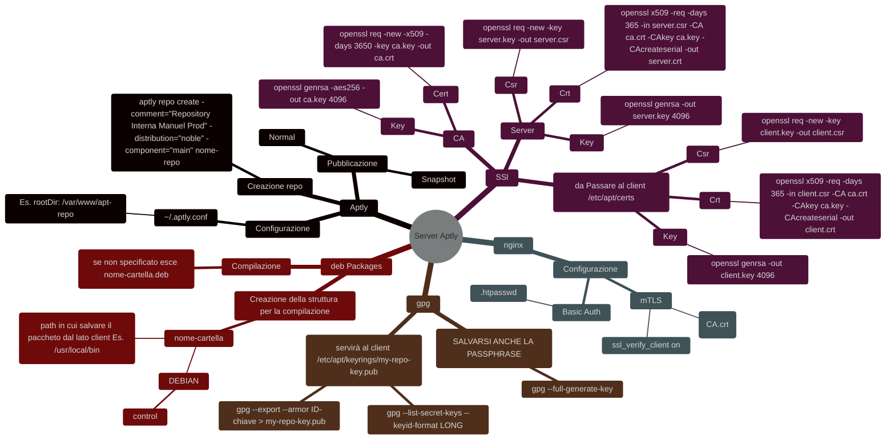
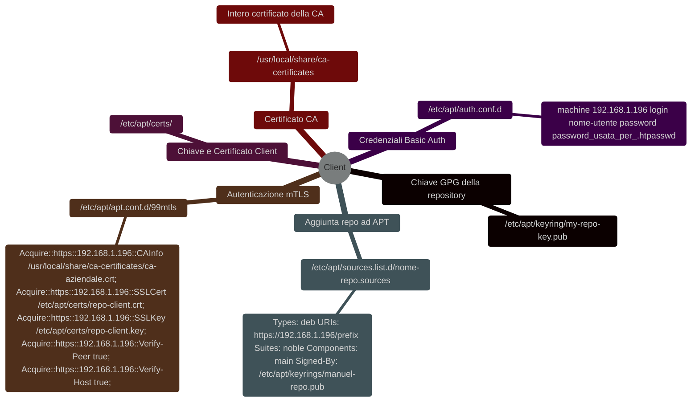
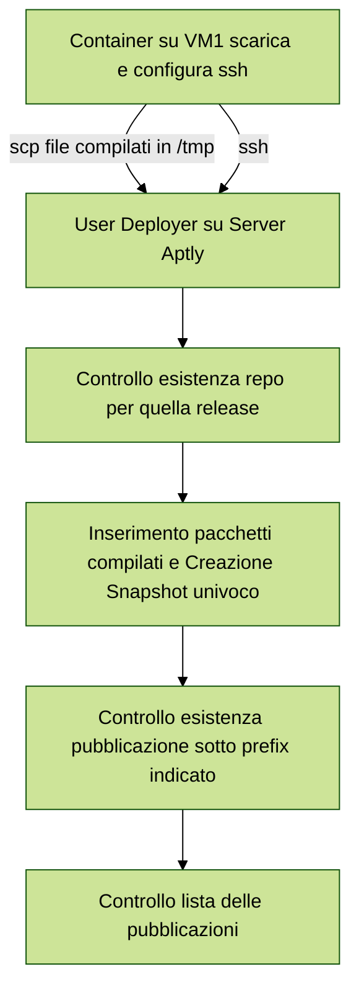
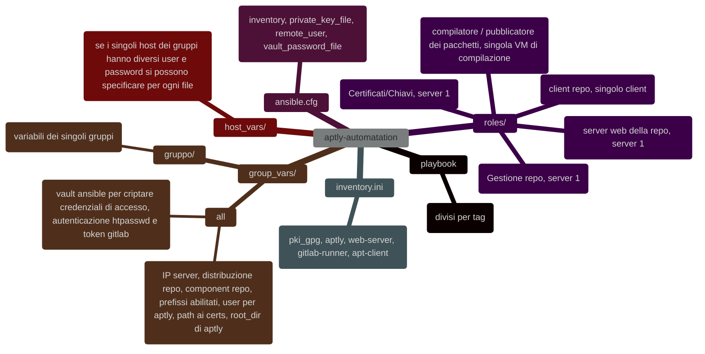

#Linux [[aptly Repository Debian-Ubuntu]] [[Note gestione automazione aptly]]


# **Configurazione repository**

## **Lato Server**

### Requisiti repo server
```shell
1. gpg       #Permette di creare chiavi con cui firmare la propria repository

2. dpkg-deb  #Permette di compilare il pacchetto in .deb

3. aptly     #Permette di creare le proprie repository

4. openssl   #Generazione delle chiavi e dei certificati per CA/Server/Client

5. nginx     #Server web su cui hostare la repository
```


## **Lato client**

### Requisiti repo client
```shell
1. Chiave GPG della repository (controllo che la repository sia quella corretta)

2. Certificato della CA (controlla che il server web sia quello giusto)
   
3. Aggiungere repository ad apt 
   
4. Chiave e certificato del client
   
5. Attivare il mTLS
   
6. Avere le credenziali per il Basic Auth
```



>[!IMPORTANT] Il client dovrà avere tra le authorized keys la chiave pubblica di Ansible in modo che esso possa operare su tale client

---
# **CI/CD Packages**

## **Lato Server**

### Requisiti CI/CD server
```shell
1. GitLab runner       (Permette di eseguire i job)
```

## **Lato Client**

### Requisiti CI/CD client
```shell
1. Accesso alla repository GitLab su cui pushare i file
   
2. Variabili su gitlab per autenticazione (CHIAVI SSH, ID-chiave-GPG, Passphrase chiave gpg)
```

---

# ==**WORKFLOW SYS-DEV**==

## Dev:
>Una volta finito il progetto ==**PRIMA**== di pusharlo usando la pipeline di GitLab dovrà notificare l'amministratore di Sistema. 

## Sys-Admin
>Ricevuta la notifica del Dev cambierà le variabili relative alla repository nel ruolo Ansible:
>- **repo_comment** (group_vars/aptly):
>- **repo_name**(group_vars/aptly):
>- **repo_distribution**(group_vars/all):
>- **repo_component**(group_vars/all):
>- **enabled_prefixes**(group_vars/all):

## Playbook
>Il playbook Ansible si occuperà della creazione della repository e della pubblicazione di un primo snapshot per rendere già funzionante la repository.

## Pipeline
### **Compilazione**
>- Developer sviluppa un nuovo pacchetto in src/
>- Developer ha accesso alla repo di GitLab
>- Developer cambia valori delle variabili: (Nome package, versione, architettura, Maintainer, Descrizione pacchetto e prefisso)
>- Developer Pusha pacchetto (parte gitlab runner su VM-compilazione)
>- Gitlab runner builda container docker con immagine giusta per cui compilare, installa pacchetti necessari per la compilazione
>- Compila il pacchetto in .deb e lo salva come artefatto
>- Uccide il container di compilazione

###  **Pubblicazione**
> - GitLab runner prende l'artefatto del job di compilazione
> - Crea un container per il trasferimento dei file sul server della repository aptly
> - Configura la connessione 
> - Trasferisce il pacchetto .deb sul server aptly
> - Aggiunge il pacchetto all repo
> - Crea lo snapshot aptly
> - Pubblica lo snapshot aptly


---

# **Passi/Ruoli per l'automazione con Ansible**

## **Cosa è già gestito da GitLab**
>1. Creazione Immagini Docker per la compilazione
>2. Pubblicazione sul registry di GitLab
>3. Compilazione e Pubblicazione dei packages

## **Cosa deve essere gestito da Ansible**
>1. Installazione dei requisiti [[#Requisiti repo server]]
>2. Configurazione del server web nginx [[aptly Repository Debian-Ubuntu#**Configurazione Nginx completa**]]
>3. Creazione chiavi e certificati SSL (CA/Server/Client) [[aptly Repository Debian-Ubuntu#**Creazione dei certificati per il sito Nginx e i client**]]
>4. Configurazione di Aptly (directory in cui salvare i file, stesso path oppure link che punti alla cartella esposta da nginx)
>5. Installazione e configurazione( uso di docker ) GitLab runner sulla macchina di compilazione [[Cos'è Gitlab#**Installazione di un gitlab-runner su di un server debian/ubuntu**]]
>6. Trasferimento dei file necessari al client [[#Requisiti repo client]]

## ***Ruoli di Ansible***
1. [x] Installazione, configurazione di Nginx 
2. [x] Installazione e configurazione directory di aptly
3. [x] Creazione certificati e chiavi
4. [x] Spostamento sui client dei file
5. [x] Installazione e registrazione gitlab runner
6. [ ] **Suddividere Macchina server aptly+nginx e macchina CA?**
7. [x] Creare CA-intermediate (lasciare la CA principale segreta) creazione fullchain.pem
8. [ ] **Creare utente dedicato ad Ansible su ogni nodo del client?**
9. [ ] **???Utilizzo certificati con CA autorizzata (Certbot, ecc..)???**
10. [x] Controllo della possibilità di inserire variabili per rendere più dinamico il playbook (nomi file chiavi e certificati, )


### **Struttura generale Ansible***



## ==*Procedure NON automatizzabili*==
1. Creazione Token e URL per il GitLab runner [[Cos'è Gitlab]]
2. **Copiare la chiave pubblica di Ansible su vari client (per la prima volta a causa della passphrase)**
3. Inserimento delle variabile per la CI/CD di GitLab (Chiave privata ssh per collegarsi allo user sul server aptly per pubblicare i pacchetti. 
   Mail associata alal chiave GPG )

---
# **Funzionamento Playbook**

## Playbook Principale
>Il playbook principale si occupa della **suddivisione del compito in 3 step (setup server repository, setup runner di compilazione, setup clients)**.
>OgniUsare più vault